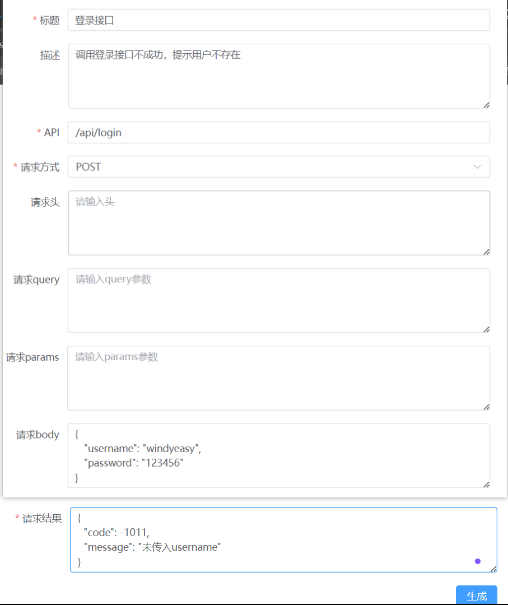
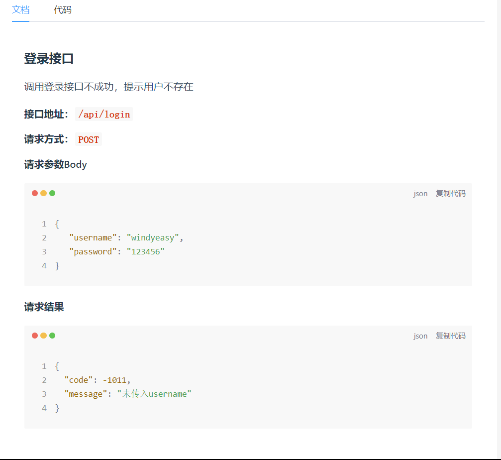
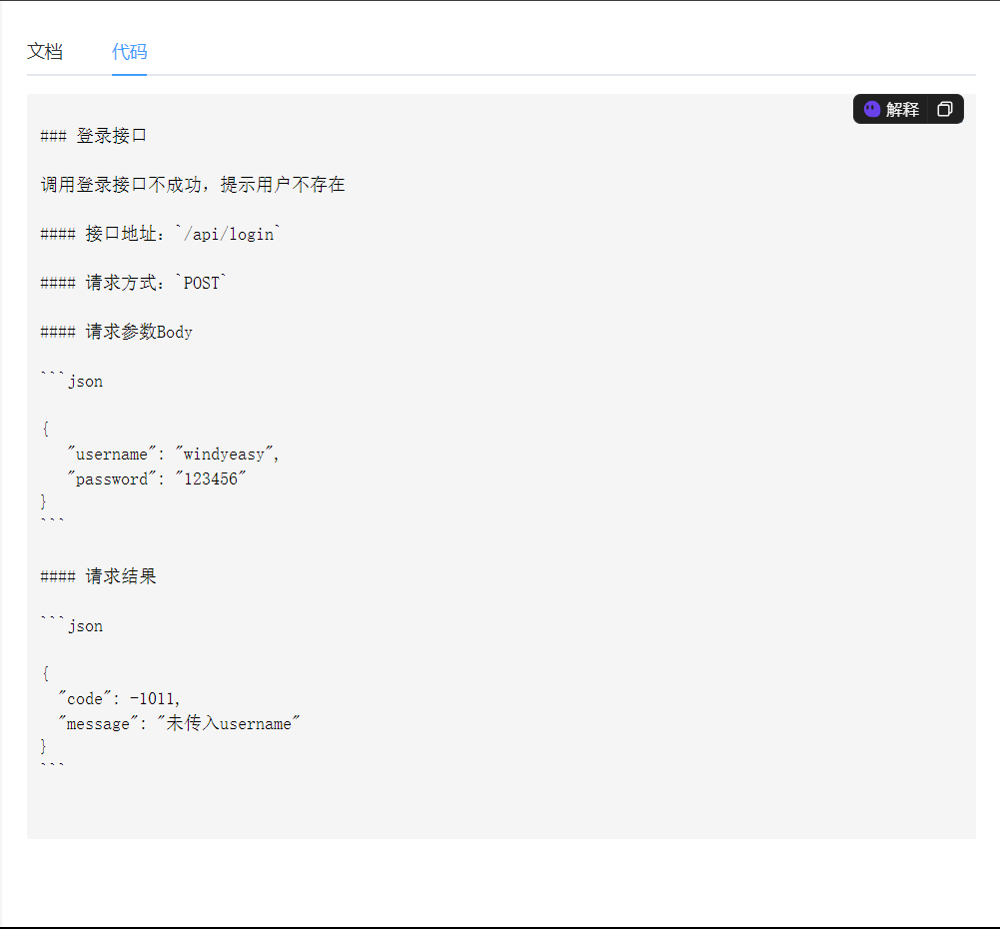

<h1 align="center">generate-api-issue-doc</h1>

在接口对接的过程中生成错误信息接口文档，通过base64转码生成一个连接直接发送给接口对接人，可以直接查看错误信息。也可以利用这个工具生成简单接口文档。

## 运行项目

使用node 16.0及以上的版本

### 安装依赖

```sh
pnpm install
```

### 编译重新加载开发

```sh
pnpm run dev
```
## 提交方法
由于使用了husky + commitlint对提交进行验证，需要使用如下几种方法提交

* 方法一：
```shell
pnpm run commit
```

* 方法二：提交时直接使用规范的格式
```shell
git commit -m "feat: 添加一个新特性"
```

## 预览

预览地址(https://windyeasy.github.io/generate-api-issue-doc/#/home)
- 填写表单：

- 查看文档：

- 查看markdown的代码：


## License

generate-api-issue-doc is [MIT](./LICENSE).
